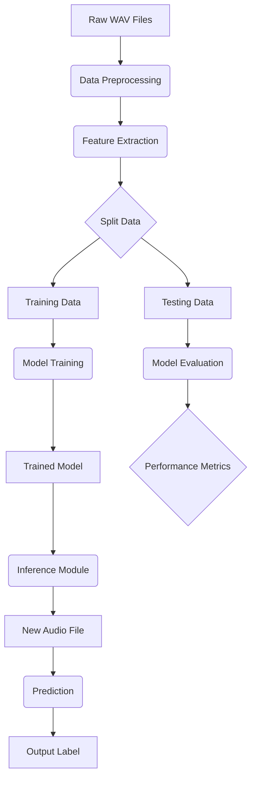

### **1. Introduction**

The architecture for the Spoken Digit Classification system is designed to be lightweight, modular, and efficient. It follows a traditional machine learning pipeline, with a clear separation of concerns to ensure code quality and extensibility. The system's core components are the data pipeline, the classification model, and the inference module. This document outlines the technical design, component interactions, and the rationale behind key architectural decisions.

-----

### **2. Architectural Diagram**

The system follows a sequential, data-driven architecture.

**Key Components:**

  * **Data Ingestion:** Reads the raw `.wav` files from the FSDD dataset.
  * **Data Preprocessing:** Resamples audio to a consistent rate and normalizes the amplitude.
  * **Feature Extraction:** Extracts meaningful features from the preprocessed audio.
  * **Data Split:** Divides the dataset into training and testing sets.
  * **Model Training:** Trains the classification model on the training data.
  * **Model Evaluation:** Assesses the model's performance on the testing data.
  * **Inference Module:** Loads the trained model and predicts the digit from new audio input.

-----

### **3. Component Details**

#### **3.1 Data Pipeline**

The data pipeline is the foundation of the system. It will be implemented in a dedicated `src/data_processing.py` module.

  * **Audio Loading:** The **`librosa`** library will be used to load `.wav` files. `librosa` is a standard in audio processing and handles various formats and bit depths, ensuring reliability.
  * **Feature Extraction:** **Mel-Frequency Cepstral Coefficients (MFCCs)** will be the primary audio feature. MFCCs are a robust representation of the short-term power spectrum of a sound, based on a linear cosine transform of a log power spectrum on a nonlinear mel scale of frequency. They are well-suited for speech recognition and have a lower dimensionality compared to spectrograms, which contributes to a more lightweight model. The number of MFCCs will be a tunable hyperparameter, starting with **13 or 40 coefficients**, as these are common values in speech recognition literature.
  * **Feature Padding:** Because audio files in the FSDD dataset have varying lengths, the extracted MFCC arrays will be padded or truncated to a uniform length. This is a crucial step for feeding data into a neural network with a fixed input size.
  * **Normalization:** The extracted MFCC features will be normalized to have a mean of 0 and a standard deviation of 1. This helps in faster convergence during model training.

#### **3.2 Classification Model**

The model is a **Convolutional Neural Network (CNN)**, implemented in `src/model.py`. A CNN is an excellent choice because it can automatically learn hierarchical patterns and features from the structured audio data (MFCCs or spectrograms).

  * **Model Type:** A **2D CNN** will be used, treating the MFCC array as a 2D "image" (time vs. MFCC coefficient). This allows the model to learn both temporal and frequency-domain patterns simultaneously.
  * **Architecture:** The model will be kept simple to maintain its lightweight nature. A potential architecture is as follows:
      * **Input Layer:** A 2D input layer with a shape corresponding to the padded MFCC array.
      * **Convolutional Blocks:** Two or three blocks, each containing a **`Conv2D`** layer followed by an activation function (**ReLU**), and a **`MaxPooling2D`** layer to reduce dimensionality.
      * **Flattening:** A `Flatten` layer to convert the 2D feature maps into a 1D vector.
      * **Dense Layers:** Two **`Dense`** (fully connected) layers for final classification, with the last layer having 10 units (for digits 0-9) and a **softmax** activation function.
  * **Training:** The model will be trained using the **Adam optimizer** and the **sparse categorical cross-entropy** loss function, as the labels are integers (0-9).

#### **3.3 Inference Module**

The inference module, implemented in `src/inference.py`, is designed for fast, real-time predictions on new data.

  * **Model Loading:** The module will load a pre-trained model from a saved file (e.g., `.h5` or `.pb` format).
  * **Real-time Preprocessing:** It will replicate the same preprocessing steps used during training (feature extraction, padding, normalization) on a single new audio file.
  * **Prediction:** The pre-processed feature array is fed into the loaded model, and the prediction is returned.
  * **Latency Measurement:** The module will use **`time.perf_counter()`** to accurately measure and report the time taken for the entire inference process, from feature extraction to final prediction. This addresses the responsiveness requirement.

-----

### **4. Technology Stack**

  * **Python 3:** The core programming language.
  * **TensorFlow/Keras:** The primary framework for building and training the CNN model. Keras provides a high-level API for rapid prototyping.
  * **Librosa:** For efficient and robust audio processing and feature extraction.
  * **Scikit-learn:** For data splitting, normalization, and evaluation metrics (e.g., confusion matrix).
  * **NumPy:** For numerical operations and data handling.
  * **Mermaid.js:** For generating architectural diagrams in markdown.
  * **`audiomentations` (Bonus):** A library for data augmentation and simulating noise.