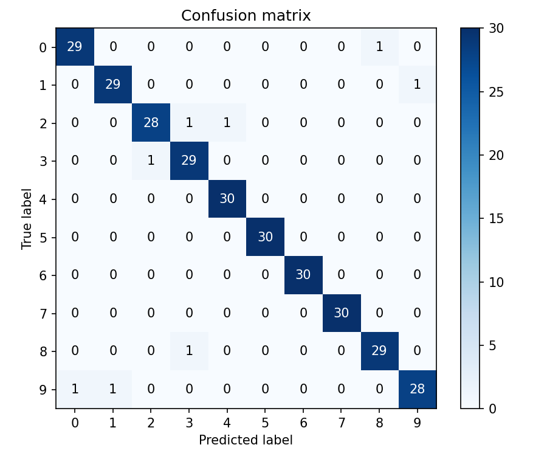
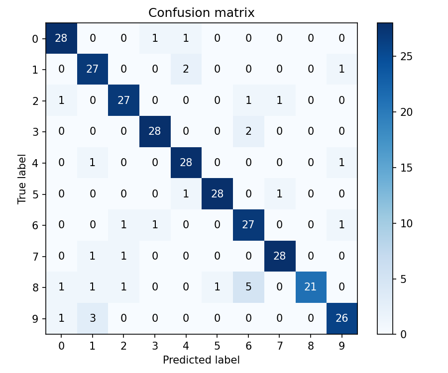
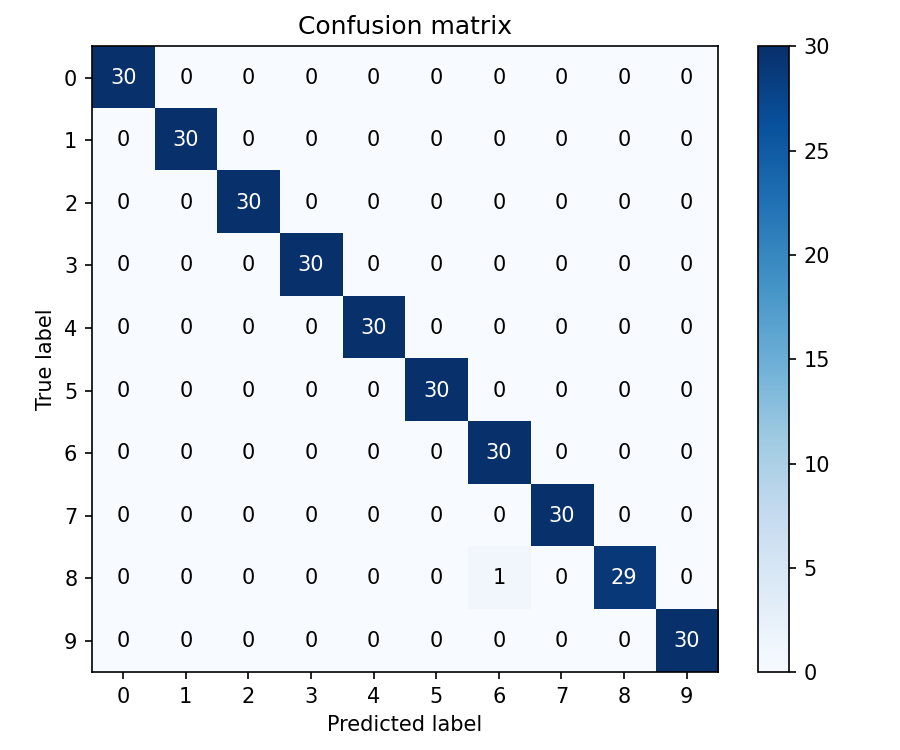

# Spoken Digit Classifier (FSDD)

## Approach
- I started with a product-style plan and documentation (PRD, architecture), used Gemini deep research to choose methods and libraries, and designed sprints with tickets.
- I used Cursor to implement tickets end-to-end: each new feature or bug fix was groomed into a ticket and executed as a small, testable edit.
- Midway, I added three model paths in parallel: a strong but simple SVM baseline on MFCCs, a fine-tuned online audio model (Wav2Vec2), and my own TensorFlow CNN.
- All models scored well on held-out test data; only the fine-tuned Wav2Vec2 model consistently performed well in the live microphone setting.
- Throughout, when requirements changed or new issues appeared, I created new sprints and tickets and iterated quickly with Cursor to maintain momentum and traceability.

This repository contains three models to classify spoken digits (0–9) from the Free Spoken Digit Dataset (FSDD):
- Baseline SVM on MFCCs
- TensorFlow/Keras CNN on MFCCs (saved as `models/custom_tensorflow_cnn.keras`)
- Wav2Vec2 transformer fine-tuned for 10 classes

The code is organized to make setup, training, evaluation, single-file inference, and live microphone inference straightforward.

#### Extra Notes:
- Cross Validation and Grid Search were implemented to evaluate and find the best model tuning.
- Wav2Vec2 is a model that uses 16kHz audio data, to handle this case I convert the 8kHz input data in the preprocessing step to 16kHz and then predict

## 1) Setup

- Python 3.10+ recommended
- macOS users may need FFmpeg for audio: `brew install ffmpeg`

Create a virtual environment and install dependencies:
```bash
python -m venv .venv
. .venv/bin/activate
pip install --upgrade pip
pip install -r requirements.txt
```
Data loads automatically from Hugging Face: `mteb/free-spoken-digit-dataset` (no manual download).


## 2) Project Structure (top-level)

```
llm-digit-audio-classifier_coding_challenge/
  ├─ Build Documentation/        # Progress, troubleshooting, structure snapshots
  ├─ Cursor Ticket Prompts/      # Executable prompts per sprint/ticket
  ├─ Documentation/              # Product/architecture docs & assets
  ├─ models/                     # Saved models, logs, confusion matrices
  ├─ src/                        # Source code (training/eval/inference/live)
  ├─ tests/                      # Unit tests
  ├─ Tickets/                    # Sprint tickets/overviews
  ├─ README.md
  ├─ requirements.txt
```
Key files in `src/`:
- `data_processing.py`: MFCC extraction, normalization, dataset loading, augmentation
- `model.py`: Keras CNNs, helpers
- `baseline.py`: SVM/logistic baseline builder and training utilities
- `train_all.py`: UNIFIED training entry point for all models (use this)
- `evaluate.py`: UNIFIED evaluator (accuracy, per-class metrics, confusion matrix)
- `inference.py`: Single-file inference (+ latency)
- `live_inference.py`: Live mic VAD/segmentation, confidence gating, temperature scaling
- `wav2vec2_train.py`: Wav2Vec2 fine-tuning (used internally by `train_all.py`)


## 3) Training (unified)

Train any model via `src/train_all.py`:
```bash
python -m src.train_all --arch {baseline|keras|wav2vec2} --mode {train|cv|grid|cvgrid} [options]
```

Parameter reference:
- Common
  - `--name <str>`: Base name for artifact (default auto). Use to avoid confusion across runs.
  - `--avoid_overwrite`: If target exists, append timestamp automatically.
  - `--cleanup`: Delete the artifact after verifying it was created (useful for smoke tests).
  - `--epochs <int>`: Training epochs (default 1 for quick checks).
  - `--batch_size <int>`: Batch size.
  - `--mode`: Training strategy
    - `train`: single fit
    - `cv`: K-fold CV (keras/baseline)
    - `grid`: run grid search
    - `cvgrid` (keras): grid over LR, scored via K-fold
- MFCC feature params (baseline, keras)
  - `--max_len <int>`: Pad/truncate frames (default 200)
  - `--n_fft <int>`: FFT size (default 512)
  - `--hop_length <int>`: Hop size (default 128)
  - `--add_deltas`: Append Δ and ΔΔ to MFCCs
- Cross-validation & grids
  - `--cv_folds <int>`: K in K-fold CV (keras)
  - `--gs_folds <int>`: Folds used inside grid search (keras/baseline)
- Baseline SVM grids
  - `--svm_C_grid <csv>`: e.g., `0.5,1.0,2.0,4.0`
  - `--svm_gamma_grid <csv>`: e.g., `scale,auto`
- Keras (TensorFlow CNN) grids
  - `--keras_lr_grid <csv>`: e.g., `0.001,0.0005,0.0001`
- Wav2Vec2
  - `--lr <float>`: single-run LR
  - `--w2v2_lr_grid <csv>`: e.g., `5e-5,1e-4`

Stratification:
- K-fold CV uses StratifiedKFold (keras/baseline). Single-run keras uses a simple validation split (15%).

Examples:
- Baseline grid (with CV internally) and verbose output:
```bash
python -m src.train_all --arch baseline --mode grid \
  --svm_C_grid 0.5,1.0,2.0,4.0 --svm_gamma_grid scale,auto \
  --name svm_grid_run --avoid_overwrite
```
- Keras CV+grid (search LR by K-fold):
```bash
python -m src.train_all --arch keras --mode cvgrid --epochs 3 --batch_size 32 \
  --keras_lr_grid 0.001,0.0005,0.0001 --cv_folds 5 --gs_folds 5 \
  --name tensorflow_cnn_cvgrid --avoid_overwrite
```
- Wav2Vec2 LR grid (best copied into the base dir; per-LR in lr_* subfolders):
```bash
python -m src.train_all --arch wav2vec2 --mode grid --epochs 1 --batch_size 8 \
  --w2v2_lr_grid 5e-5,1e-4 --name w2v2_grid --avoid_overwrite
```


## 4) Evaluation (unified)

Evaluate a trained model on HF test split and generate metrics + confusion matrix:
```bash
python -m src.evaluate --arch {baseline|keras|wav2vec2} --model <path_or_dir> [options]
```
- Options: `--split test` (default), MFCC params for baseline/keras (`--max_len --n_fft --hop_length --add_deltas`), `--out`, `--save_cm`.

Examples:
```bash
# Baseline
python -m src.evaluate --arch baseline --model models/baseline_svm.joblib --add_deltas --save_cm
# Keras
python -m src.evaluate --arch keras --model models/custom_tensorflow_cnn.keras --add_deltas --save_cm
# Wav2Vec2
python -m src.evaluate --arch wav2vec2 --model models/wav2vec2_digits --save_cm
```


## 5) Single-file Inference

```bash
python -m src.inference --arch {baseline|keras|wav2vec2} [--audio <wav>|--hf_idx <int>] [options]
```
- Baseline: `--model models/baseline_svm.joblib`, `--pool {flat|mean|max}`
- Keras: `--keras_model models/custom_tensorflow_cnn.keras`
- Wav2Vec2: `--w2v_dir models/wav2vec2_digits`
- Latency: `--warmup <int>`, `--runs <int>` (avg/p95)

Examples:
```bash
python -m src.inference --arch keras --keras_model models/custom_tensorflow_cnn.keras --hf_idx 0 --add_deltas
python -m src.inference --arch baseline --model models/baseline_svm.joblib --hf_idx 0 --add_deltas --pool flat
python -m src.inference --arch wav2vec2 --w2v_dir models/wav2vec2_digits --hf_idx 0
```


## 6) Live Microphone (streaming, no toggle)

```bash
python -m src.live_inference --arch {baseline|keras|wav2vec2} [options]
```
- Use `--ptt` to capture one window per Enter press (no toggle).
- Key parameters: `--capture_sr`, `--duration`, `--stride`, `--vad`, `--vad_thresh`, `--min_speech_ms`, `--hangover_ms`, `--conf_thresh`
- Confidence shaping (keras/w2v2): `--temp <float>` (<1 sharpens), `--force_emit` (emit top-1 at segment end even if below threshold)

### Important Note: Due to the Confidence Threshold of the predictions only the fine-tuned Model of Wav2Vec2 has the live mic predictions, consistently working.

Examples:
```bash
# Baseline
python -m src.live_inference --arch baseline --model models/baseline_svm.joblib \
  --add_deltas --max_len 200 --n_fft 512 --hop_length 128 \
  --duration 1.0 --vad --vad_thresh 0.02 --min_speech_ms 400 --hangover_ms 200 \
  --conf_thresh 0.8 --ptt --capture_sr 8000

# Keras
python -m src.live_inference --arch keras --keras_model models/custom_tensorflow_cnn.keras \
  --add_deltas --max_len 200 --n_fft 512 --hop_length 128 \
  --duration 1.1 --vad --vad_thresh 0.03 --min_speech_ms 500 --hangover_ms 250 \
  --conf_thresh 0.85 --temp 0.7 --force_emit --ptt --capture_sr 8000

# Wav2Vec2
python -m src.live_inference --arch wav2vec2 --w2v_dir models/wav2vec2_digits \
  --duration 1.1 --vad --vad_thresh 0.03 --min_speech_ms 500 --hangover_ms 250 \
  --conf_thresh 0.6 --ptt --capture_sr 8000
```


## 7) Results (HF test)

- Baseline SVM: 
  - accuracy 0.9733
  - precision 0.9734
  - TP-rate 0.9733 
  - FP-rate 0.0030
  - F1 0.9733
- Keras (custom_tensorflow_cnn):
  - accuracy 0.8933
  - precision 0.8997
  - TP-rate 0.8933
  - FP-rate 0.0119
  - F1 0.8930
- Wav2Vec2:
  - accuracy 0.9967
  - precision 0.9968
  - TP-rate 0.9967
  - FP-rate 0.0004
  - F1 0.9967

Confusion matrices:






## 8) Notes
- If Wav2Vec2 evaluation fails due to dependencies, ensure `transformers`, `datasets`, and FFmpeg are installed.
- Low live confidence? Increase `--duration` and `--min_speech_ms`, sharpen with `--temp 0.7`, enable `--force_emit`.